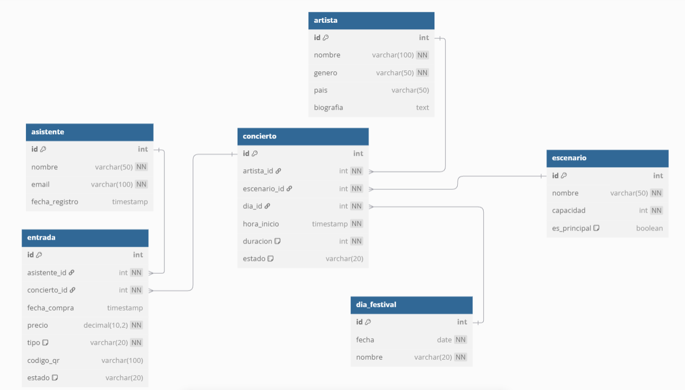

# BD_Festival

[Script para la generación de las tablas y la inserción de los datos](tablesAndData.sql)

## Ejercicio 1
> Generar un informe resumen del festival.
> Crea un bloque anónimo que muestre:
> - Nombre del festival (variable constante)
> - Fechas de celebración (primero y último día de la tabla dia_festival)
> - Número total de artistas con conciertos programados
> - Número de escenarios utilizados
> - Precio medio de todas las entradas vendidas
> - Recaudación total estimada

[Código del ejercicio 1](ej1.sql)

---

## Ejercicio 2
**FUNDAMENTOS DEL LENGUAJE**
*Tipos de datos:*
Declara variables para almacenar:
- Día con más entradas vendidas (basado en conciertos)
- Franja horaria con más conciertos programados
- Porcentaje de ocupación promedio de los escenarios
- Artista con más conciertos programados (registro con nombre y género)
- Precio máximo y mínimo de entradas vendidas

[Código del ejercicio 2](ej2.sql)

---

## Ejercicio 3
**CONTROL DE FLUJO**
*Condicionales:*
Crea un bloque que:
1. Reciba un ID de concierto (usar &input)
2. Calcule el precio base según:
   - 50€ si el día es fin de semana (sábado o domingo)
   - 35€ si es día laborable
   - +20% si el escenario es principal (campo es_principal = 1)
3. Muestre el precio calculado con el desglose
4. Maneje adecuadamente posibles errores

[Código del ejercicio 3](ej3.sql)

---

## Ejercicio 4
**Caso práctico: Asignar descuentos según tipo de entrada**
*CASE*
Crea un bloque que:
1. Pida un ID de asistente (usa &input)
2. Verifique si tiene entradas VIP (tipo = 'VIP')
3. Cuente el total de entradas compradas por el asistente
4. Aplica un descuento del 5% si ha comprado 3 entradas o más
5. Muestra por pantalla el cálculo completo con los descuentos aplicados

[Código del ejercicio 4](ej4.sql)

---

## Ejercicio 5
**Caso práctico: Venta de entradas**
*Procedimientos*

---oracle
CREATE OR REPLACE PROCEDURE vender_entrada(
    p_asistente_id NUMBER,
    p_concierto_id NUMBER,
    p_tipo_entrada VARCHAR2
) IS
---
Completa con:
1. Control de capacidad (no superar 90% del escenario)
2. Cálculo de precio según tipo de entrada (GENERAL/VIP/PREMIUM)
3. Confirmación con ID de entrada generada

[Código del ejercicio 5](ej5.sql)

---

## Ejercicio 6
**Caso práctico: Consultas útiles**
*Funciones*

---oracle
CREATE OR REPLACE FUNCTION calcular_ocupacion(
    p_concierto_id NUMBER
) RETURN NUMBER IS
---

Devuelve porcentaje de ocupación para un concierto específico:
1. Obtiene capacidad del escenario relacionado
2. Cuenta entradas vendidas para ese concierto
3. Calcula: (entradas_vendidas / capacidad) * 100
4. Maneja casos donde no hay datos

[Código del ejercicio 6](ej6.sql)

---

## Ejercicio 7
**Caso práctico: Validar ventas**
*Excepciones*

Mejora el procedimiento vender_entrada para:
1. Validar que el concierto existe y está ACTIVO
2. Verificar que el asistente existe
3. Evitar sobreventa (>90% capacidad usando la función calcular_ocupacion)
4. Registrar intentos fallidos en tabla ERRORES con:
   - Fecha/hora
   - Tipo de error
   - Datos relevantes (IDs, tipo de operación)
5. Proporcionar mensajes de error claros

[Código del ejercicio 1](ej1.sql)
